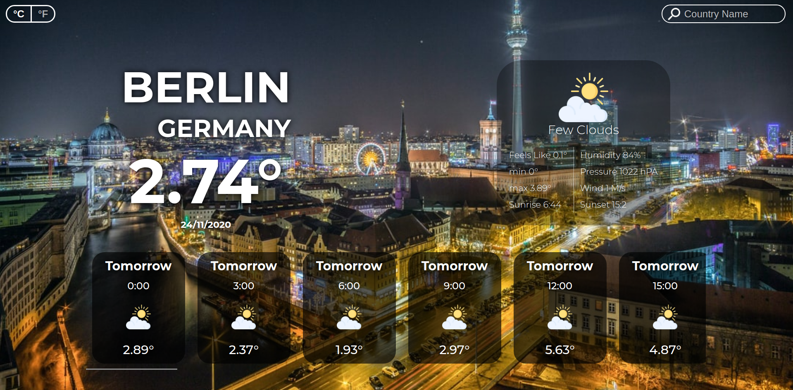

# Weather App: Takss

> This a simple weather application, that detect users location at first and then show weather data for Today and 5 days forcast, it also allow users to look for weather info in other cities in the world by typing the name of the city in the search field on the top right corner and also you can change tempature unit but toggling the button on the left top corner. 



## Built With

- Vanilla JavaScript,
- the CSS preprocessor SCSS,
- webpack,
- babel,
- stylelint,
- ESlint

## Live Demo

[Live Demo](https://elmejdki.github.io/Weather-app/)

## Getting started

### Prerequisites

In order to have this project up and running you will need:

- NodeJS 10+

### Setup

First you need to clone this project using one of the links above, using this command:

`git clone RESPOSITRY_LINK`

Then you should run: `npm install`

And afterwards you supposed to run: `npm run server`, to run the project in your local machine.

Congrats the project is fully working.

_You may have some issues with the `image-webpack-loader`  but that depend on your operating system each operating system has his own way to solve it, if you goggled it just for some couple minutes I'm sure you will find the solution, if not you can contact me any time you need I will be happy to help, my contact informations are below_

### Deployment

For deployment I used GitHub pages, but as you see my project is full of files and the `index.html` file is inside the `build/` folder, so in order to deploy using GitHub pages we need to put the `index.html` file in the root of the repository, in order to do this we will use a simple trick, please follow the commands bellow if you want to deploy on your on repository:

- If you have the `build/ `  folder declared inside the `.gitignore`  file please remove it form there.

- run `npm run build`  to generate the build folder.

- then make sure that git knows about your subtree, using this command:

  ```
  git add build && git commit -m "Initial build subtree commit"
  ```

- after that use subtree push to send it to gh-pages branch in GitHub:

  ```
  git subtree push --prefix build origin gh-pages
  ```

Now you have finish check the link of GitHub pages you will find your project deployed there. you can find the link on the repository settings page.

# Future Feature

- Add an API that returns images based on location and weather.
- User an accurate API for weather to get better weather data.

## Author

👤 **Zakariae El Mejdki**

- Github: [@elmejdki](https://github.com/elmejdki)
- Twitter: [@zakariae_elmejdki](https://twitter.com/zakariaemejdki)
- Linkedin: [El Mejdki Zakariae](https://www.linkedin.com/in/zakariaeelmejdki/)

## 🤝 Contributing

Contributions, issues and feature requests are welcome!

Feel free to check the [issues page](https://github.com/elmejdki/Weather-app/issues).

## Show your support

Give a ⭐️ if you like this project!

## 📝 License

This project is [MIT](lic.url) licensed.
